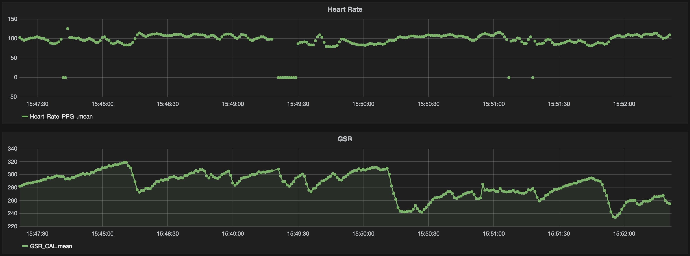

Products Used
-------------

InfluxDB - Time Series Database

* https://influxdb.com

Grafana - Data Visualisation Tool

* http://grafana.org

Docker - Container Hosting Tool

* http://www.docker.com

Local Development Setup
-----------------------

Using Docker.

Run InfluxDB:

```
docker run -d -p 8083:8083 -p 8086:8086 --expose 8090 --expose 8099 -e PRE_CREATE_DB=shimmer tutum/influxdb
```

This will create an initial database called ``shimmer``.

No storage is being mounted, so at this point data would be lost it container
restarted. This can be addressed by mounting external volume on ``/data``.

Run Grafana:

```
docker run -i -d  -p 3000:3000 grafana/grafana
```

Need to create a data source point Grafana at local InfluxDB. See:


Password for InfluxDB is default of ``root``.

Grafana dashboard configuration can be found in [shimmer-grafana-dashboard.json](shimmer-grafana-dashboard.json).



